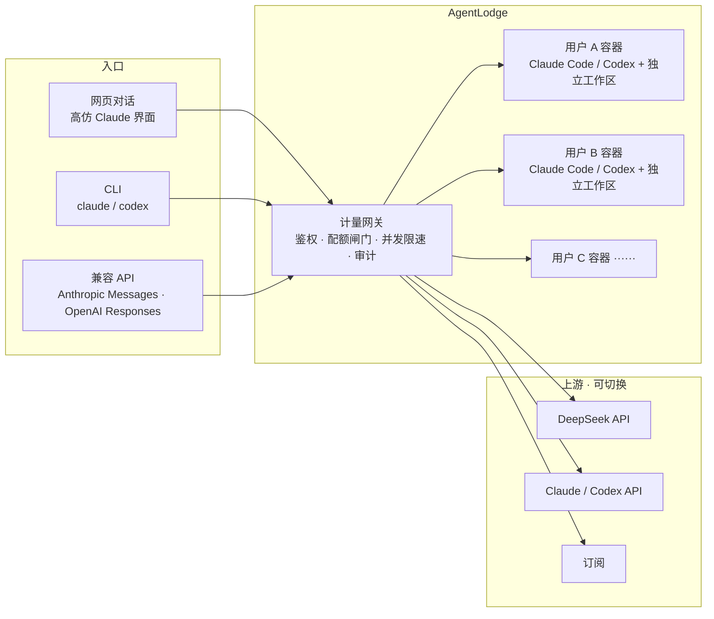

# AgentLodge

**[中文](./README.md) · [English](./README.en.md) · [项目页](https://wrfly.kfd.me/AgentLodge/)**

把编程 Agent（Claude / Codex）包装成多租户的 Web 服务：网页对话、兼容 Claude/Codex 的 API、
自带 CLI，每用户一个独立沙箱 agent。底层可接入 DeepSeek、Claude、Codex 或订阅等多种上游。

- **网页直接对话**，高仿 Claude 界面，多人各用各的，对话各自私密。
- **兼容 Anthropic Messages 与 OpenAI Responses 两种协议**，照常敲 `claude` / `codex`。
- **按 token 或按金额计量**，配额在 turn 内部就刹得住，agent 跑飞了当场停。
- **每用户独立容器**，各挂自己的工作目录，互不可见。



## 功能特性

**账号**
- [x] 邀请码注册、邮件定向邀请（SendGrid）
- [x] access token + refresh token 轮转，**重放即判定泄漏**并撤销该用户全部会话
- [x] 改密码、忘记密码、多设备管理、停用即时踢线
- [x] 登录失败按 IP + 邮箱双维度锁定

**计量与配额**
- [x] agent 的上游请求强制经网关，逐次调用从 SSE 流里旁路解析 usage
- [x] 配额闸门在 turn 内部生效；日 / 周 / 月 / 总量周期，重置时刻精确到小时
- [x] 全局并发闸门（默认 ≤3 in-flight），用户级轮转 + AIMD 自适应，后台热调
- [x] 按 token 或按金额计费，价格表可改且历史账单锁定当时价格
- [x] **每个用户看到的是自己的额度**，不是共享订阅的池子——响应头按其配额重写
- [x] **管理员单独看得到上游套餐的真实利用率**与重置时刻

**隔离**
- [x] 每用户一个常驻容器，非 root、CapDrop ALL、内存 / CPU / PID 限额
- [x] 只挂载自己的工作目录，容器内无任何凭据
- [x] 工作区文件读写经真实路径校验，符号链接逃逸有测试覆盖

**接入**
- [x] 网页对话（高仿 Claude 界面）、附件、Markdown + 代码高亮
- [x] 长期记忆：**助手在对话里自己写下来**，下次对话自动读回；`/memory` 页面可查看、
      修改、删除、手动补充，改坏了可一键撤销
- [x] 使用画像：什么时候在用、多少轮让它动了手、被打断多少、怎么提问——纯统计，
      不经过模型，只有本人看得到
- [x] 会话总结：每个对话一句话存下来、顺手换成说明内容的标题，再从这些总结写出一段画像，
      并给出「值得记住的」候选，点一下才进记忆
- [x] 自带 CLI 接入：一条命令装好，之后照常敲 `claude`
- [x] 同时支持 Anthropic Messages 与 OpenAI Responses 两套协议
- [x] 多条上游同时生效，路由按模型走：同一个模型可以挂多条上游，各配各的价格
- [x] 上游凭据集中在一个单独的服务里：控制台登录订阅、粘贴 key、或指向别人轮换的文件，
      库里只存名字，网关每次请求换一个短命 token
- [x] 内置假 provider，零成本试全链路

**运维**
- [x] 出网审计代理，完整 prompt 落盘，后台可开关、可清空
- [x] 后台改配置无需重启：额度、价格、并发、provider、站点信息
- [x] 忘记密码又没配邮件时，可以在部署机器上重置——不经过 HTTP，撤销该用户全部会话
- [x] 界面、后台设置项与 API 错误文案支持 9 种语言：简体中文 / 繁體中文 / English / 日本語 /
      Русский / Deutsch / Français / Español / Português，覆盖率由 `npm run typecheck` 机器校验
- [x] 镜像按组件拆开发布，`docker compose` 两个文件拉起

**尚未提供**
- [ ] 余额趋势与三口径对账、会话搜索、附件在对话内引用（M4）
- [ ] 多实例部署（并发闸门换成 Redis 信号量）（M5）

## 快速开始

```bash
npm install
JWT_SECRET=$(openssl rand -base64 32) npm run dev
```

打开 http://localhost:5173，控制台会打印一个 bootstrap 邀请码，用它注册的第一个账号
自动成为管理员。

本机需要安装 `claude` 和/或 `codex`。缺少哪个，对应页面会说明原因，不影响另一个。

只提供其中一个也是支持的 —— 管理员在**系统设置 → Agent**里关掉另一个即可，
它会从界面上彻底消失，而不是留在那里看着像坏了。

想零成本体验，把上游指向内置的假 provider —— 见手册。

## 从镜像部署

无需 clone，两个文件即可：

```bash
curl -fsSLO https://raw.githubusercontent.com/wrfly/AgentLodge/master/docker/compose.release.yml
curl -fsSL  https://raw.githubusercontent.com/wrfly/AgentLodge/master/docker/env.release.example -o .env
$EDITOR .env                  # 至少填 JWT_SECRET、AUDIT_ADMIN_TOKEN、DATA_DIR
sudo install -d -o 10001 -g 10001 "$DATA_DIR"   # app 和 gateway 以这个 uid 跑
docker compose -f compose.release.yml up -d
```

镜像按组件拆开发布在 Docker Hub 上。`:latest` 是最新的发布版本，`:master` 是分支的滚动构建。
fork 之后流水线自动改用你自己的账号名，不用改任何东西。
agent 镜像的标签里写着里面装的是哪个版本的 claude 和 codex。

## 更多文档

| | |
|---|---|
| [MANUAL.md](./MANUAL.md) | 运行方式、上游配置、审计代理、部署、环境变量 |
| [DESIGN.md](./DESIGN.md) | 设计思路与取舍 |
